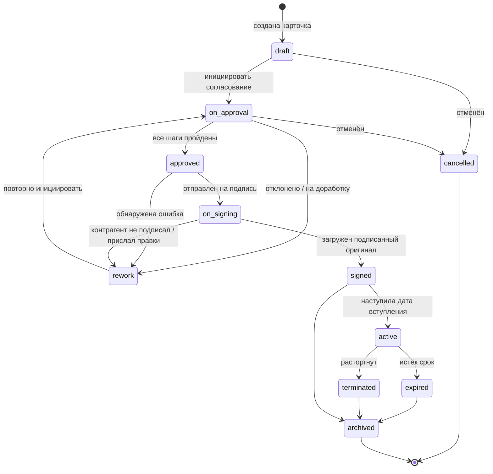

# ТЗ: Модуль документооборота («Документы») в составе таск-трекера

**Версия:** 1.0
**Дата:** 2026-07-15
**Статус:** черновик к реализации

---

## 1. Контекст и границы

### 1.1 Что делаем

Модуль согласования, хранения и версионирования документов, встраиваемый **вкладкой в существующий таск-трекер**. Переиспользует пользователей, роли, аутентификацию, уведомления и файловое хранилище трекера.

Класс системы: DMS + лёгкий CLM (contract lifecycle management). Центральная сущность — **карточка документа**, а не файл. Файл — лишь одно из её изменяемых свойств.

### 1.2 Целевой стек

| Слой | Технология |
|---|---|
| Backend | Node.js / TypeScript (стек трекера) |
| БД | PostgreSQL, отдельная схема `docs` |
| Хранилище файлов | MinIO / S3 (существующее), отдельный bucket |
| Редактор | ONLYOFFICE Docs Community Edition ≥ 9.4, self-hosted в Docker |
| Фон | Планировщик трекера или отдельный воркер (cron-задачи) |

### 1.3 Ключевое ограничение — закрытый контур

Целевая среда: **локальный сервер внутри здания без выхода в интернет**. Всё, что проектируется, обязано работать без внешних сервисов: без CDN, без облачных API, без проверки лицензий наружу, без Let's Encrypt.

Тестовый этап — на VPS с доступом в интернет, 5 тестовых сотрудников. Проектные решения принимаются сразу под закрытый контур, чтобы миграция не потребовала переписывания.

### 1.4 Что НЕ входит в этот этап

- Интеграция с Active Directory / доменом (точка расширения заложена, см. §13.2)
- Квалифицированная электронная подпись (ЭЦП). Подписание — бумажное, в систему грузится скан/PDF подписанного оригинала
- OCR и полнотекстовый поиск по содержимому файлов
- Мобильное приложение
- Интеграция с внешними учётными системами

### 1.5 Термины

| Термин | Значение |
|---|---|
| **Карточка** | Сущность документа: атрибуты + версии + маршрут + история. Живёт годами |
| **Версия** | Конкретный файл (docx) на определённый момент + автор + комментарий |
| **Маршрут** | Последовательность шагов согласования |
| **Шаблон маршрута** | Настраиваемая админом схема. Привязан к типу документа |
| **Экземпляр маршрута** | Копия-снимок шаблона в момент запуска согласования |
| **Контрагент** | Запись справочника: юрлицо со своими реквизитами |
| **Реквизиты** | Юридические и банковские данные стороны |
| **DS** | ONLYOFFICE Document Server |

---

## 2. Жизненный цикл документа

### 2.1 Диаграмма состояний



### 2.2 Таблица состояний

| Статус | Смысл | Файл редактируем? | Кто может менять статус |
|---|---|---|---|
| `draft` | Черновик, автор готовит | Да, автором | Автор, owner |
| `on_approval` | Идёт согласование | По правам шага | Движок маршрута |
| `rework` | Возвращён на доработку | Да, автором | Автор |
| `approved` | Все согласовали | **Нет** | Движок маршрута |
| `on_signing` | Ушёл на подпись | **Нет** | Owner |
| `signed` | Подписан, оригинал загружен | **Нет, навсегда** | Owner |
| `active` | Действует | **Нет** | Cron (по `effective_from`) |
| `expired` | Срок истёк | **Нет** | Cron (по `effective_to`) |
| `terminated` | Расторгнут досрочно | **Нет** | Owner |
| `archived` | В архиве | **Нет** | Owner, admin |
| `cancelled` | Отменён, не дошёл | **Нет** | Автор, owner |

### 2.3 Инварианты (обязательны к соблюдению)

1. **После `signed` карточка неизменяема.** Атрибуты, файлы, версии — read-only. Исключение: `status`, `effective_to`, `needs_review*` и добавление вложений.
2. **Версии не удаляются и не перезаписываются.** Только append.
3. **Реестровый номер присваивается один раз** и не меняется никогда, даже при отмене.
4. **Подписанный оригинал** хранится как версия с `is_signed_original = true`. Такая версия может быть только одна на карточку.
5. **Экземпляр маршрута — снимок.** Изменение шаблона админом не влияет на идущие согласования.

---

## 3. Модель данных

Схема `docs` в той же БД, что и трекер. FK на существующую таблицу пользователей (далее `public.users(id)` — уточнить фактическое имя).

### 3.1 Справочник контрагентов и наших юрлиц

Единая таблица: наша организация — тот же контрагент с флагом `is_own`. Это позволяет иметь несколько своих юрлиц и единообразно генерировать страницу реквизитов.

```sql
CREATE SCHEMA IF NOT EXISTS docs;

CREATE TABLE docs.counterparty (
  id                BIGSERIAL PRIMARY KEY,
  is_own            BOOLEAN NOT NULL DEFAULT FALSE,   -- наше юрлицо
  short_name        TEXT NOT NULL,                    -- "ООО Ромашка"
  legal_name        TEXT NOT NULL,                    -- полное наименование
  tax_id            TEXT,                             -- ИНН / RUC / VAT — generic
  reg_number        TEXT,                             -- ОГРН / рег. номер
  tax_reason_code   TEXT,                             -- КПП (опционально)
  address_legal     TEXT,
  address_actual    TEXT,
  bank_name         TEXT,
  bank_account      TEXT,
  bank_corr_account TEXT,
  bank_code         TEXT,                             -- БИК / SWIFT
  signatory_name    TEXT,                             -- ФИО подписанта
  signatory_position TEXT,                            -- должность
  signatory_basis   TEXT,                             -- "Устава" / "Доверенности №5 от ..."
  contact_email     TEXT,
  contact_phone     TEXT,
  extra             JSONB NOT NULL DEFAULT '{}',      -- нетипизированные доп. поля
  is_active         BOOLEAN NOT NULL DEFAULT TRUE,
  created_by        BIGINT REFERENCES public.users(id),
  created_at        TIMESTAMPTZ NOT NULL DEFAULT now(),
  updated_at        TIMESTAMPTZ NOT NULL DEFAULT now()
);

CREATE INDEX ON docs.counterparty (is_own) WHERE is_active;
CREATE INDEX ON docs.counterparty USING gin (to_tsvector('russian', short_name || ' ' || legal_name));
CREATE UNIQUE INDEX ON docs.counterparty (tax_id) WHERE tax_id IS NOT NULL AND is_active;
```

**Журнал изменений реквизитов** — основа механизма актуализации (§8).

```sql
CREATE TABLE docs.counterparty_history (
  id              BIGSERIAL PRIMARY KEY,
  counterparty_id BIGINT NOT NULL REFERENCES docs.counterparty(id),
  changed_by      BIGINT REFERENCES public.users(id),
  changed_at      TIMESTAMPTZ NOT NULL DEFAULT now(),
  diff            JSONB NOT NULL,   -- {"bank_account": {"old": "407...", "new": "408..."}}
  is_material     BOOLEAN NOT NULL  -- существенное ли изменение (см. §8.2)
);

CREATE INDEX ON docs.counterparty_history (counterparty_id, changed_at DESC);
```

> **Требование:** запись в `counterparty_history` создаётся в **той же транзакции**, что и UPDATE контрагента. Не триггером БД, а в сервисном слое — нужен `changed_by` из контекста запроса.

### 3.2 Классификация и типы документов

```sql
-- Группа документов ("чьи это") — дерево
CREATE TABLE docs.document_group (
  id         BIGSERIAL PRIMARY KEY,
  parent_id  BIGINT REFERENCES docs.document_group(id),
  code       TEXT NOT NULL UNIQUE,
  name       TEXT NOT NULL,
  sort_order INT NOT NULL DEFAULT 0
);

-- Тип документа: договор, допсоглашение, пояснительная записка, акт...
CREATE TABLE docs.document_type (
  id                  BIGSERIAL PRIMARY KEY,
  code                TEXT NOT NULL UNIQUE,
  name                TEXT NOT NULL,
  registry_mask       TEXT NOT NULL,        -- 'ДОГ-{YYYY}-{NNNN}'
  route_template_id   BIGINT,               -- маршрут по умолчанию (FK ниже)
  template_object_key TEXT,                 -- шаблон .docx в MinIO (NULL = свободный документ)
  attr_schema         JSONB NOT NULL DEFAULT '{}',  -- JSON Schema доп. атрибутов
  requires_counterparty BOOLEAN NOT NULL DEFAULT TRUE,
  requires_validity    BOOLEAN NOT NULL DEFAULT FALSE, -- обязателен ли срок действия
  has_requisites_page  BOOLEAN NOT NULL DEFAULT FALSE, -- генерировать страницу реквизитов
  is_active            BOOLEAN NOT NULL DEFAULT TRUE
);
```

**Маска реестрового номера.** Поддерживаемые плейсхолдеры:

| Плейсхолдер | Значение |
|---|---|
| `{YYYY}` | Год присвоения (4 цифры) |
| `{YY}` | Год (2 цифры) |
| `{MM}` | Месяц |
| `{NNNN}` | Порядковый номер, zero-padded, счётчик **в пределах (тип, год)** |
| `{GROUP}` | Код группы документов |
| `{TYPE}` | Код типа |

```sql
-- Счётчик номеров. Отдельная таблица ради атомарности.
CREATE TABLE docs.registry_counter (
  document_type_id BIGINT NOT NULL REFERENCES docs.document_type(id),
  period_key       TEXT NOT NULL,      -- '2026' или '2026-07' — зависит от маски
  last_value       INT NOT NULL DEFAULT 0,
  PRIMARY KEY (document_type_id, period_key)
);
```

> **Требование:** выдача номера — через `INSERT ... ON CONFLICT DO UPDATE SET last_value = registry_counter.last_value + 1 RETURNING last_value` в транзакции. Не через `SELECT MAX()+1` — словите гонку и дубли.
>
> **Решение к принятию:** в какой момент присваивается номер? Рекомендую — **при первом переходе в `on_approval`**, не при создании черновика. Иначе брошенные черновики выжгут дыры в нумерации, а у бухгалтерии к этому вопросы.

### 3.3 Карточка документа

```sql
CREATE TYPE docs.document_status AS ENUM (
  'draft','on_approval','rework','approved','on_signing',
  'signed','active','expired','terminated','archived','cancelled'
);

CREATE TABLE docs.document (
  id                 BIGSERIAL PRIMARY KEY,
  registry_number    TEXT UNIQUE,                    -- NULL пока черновик
  title              TEXT NOT NULL,
  type_id            BIGINT NOT NULL REFERENCES docs.document_type(id),
  group_id           BIGINT REFERENCES docs.document_group(id),
  status             docs.document_status NOT NULL DEFAULT 'draft',

  author_id          BIGINT NOT NULL REFERENCES public.users(id),
  owner_id           BIGINT NOT NULL REFERENCES public.users(id),  -- ответственный

  -- Даты
  date_signed        DATE,
  effective_from     DATE,
  effective_to       DATE,          -- NULL = бессрочный
  is_perpetual       BOOLEAN NOT NULL DEFAULT FALSE,
  is_auto_prolong    BOOLEAN NOT NULL DEFAULT FALSE, -- пролонгируется автоматически

  -- Сумма (опционально, но нужна для условий в маршруте)
  amount             NUMERIC(18,2),
  currency           CHAR(3),

  current_version_id BIGINT,        -- FK ниже, после создания document_version
  signed_version_id  BIGINT,

  -- Актуализация
  needs_review       BOOLEAN NOT NULL DEFAULT FALSE,
  needs_review_data  JSONB,         -- {"reason":"counterparty_requisites_changed", "history_id":123, ...}
  reviewed_at        TIMESTAMPTZ,
  reviewed_by        BIGINT REFERENCES public.users(id),
  review_resolution  TEXT,

  attrs              JSONB NOT NULL DEFAULT '{}',   -- доп. атрибуты по attr_schema типа
  task_id            BIGINT,        -- связь с задачей трекера (опционально)

  created_at         TIMESTAMPTZ NOT NULL DEFAULT now(),
  updated_at         TIMESTAMPTZ NOT NULL DEFAULT now()
);

CREATE INDEX ON docs.document (status);
CREATE INDEX ON docs.document (owner_id);
CREATE INDEX ON docs.document (type_id, group_id);
CREATE INDEX ON docs.document (effective_to) WHERE status IN ('active','signed');
CREATE INDEX ON docs.document (needs_review) WHERE needs_review;
CREATE INDEX ON docs.document USING gin (attrs jsonb_path_ops);
```

**Стороны документа — отдельная таблица.** Сторон может быть больше двух (трёхсторонние соглашения), и наша сторона — тоже сторона.

```sql
CREATE TYPE docs.party_role AS ENUM ('our_side','counterparty','third_party');

CREATE TABLE docs.document_party (
  id              BIGSERIAL PRIMARY KEY,
  document_id     BIGINT NOT NULL REFERENCES docs.document(id) ON DELETE CASCADE,
  counterparty_id BIGINT NOT NULL REFERENCES docs.counterparty(id),
  role            docs.party_role NOT NULL,
  -- Снимок реквизитов на момент подписания. Заполняется при переходе в signed.
  requisites_snapshot JSONB,
  sort_order      INT NOT NULL DEFAULT 0,
  UNIQUE (document_id, counterparty_id)
);

CREATE INDEX ON docs.document_party (counterparty_id);
```

> **Зачем `requisites_snapshot`:** через два года контрагент трижды сменит банк, а вам надо знать, какие реквизиты стояли в документе на дату подписания. Справочник этого не помнит — он хранит текущее состояние. Снимок помнит.

### 3.4 Версии

```sql
CREATE TABLE docs.document_version (
  id                 BIGSERIAL PRIMARY KEY,
  document_id        BIGINT NOT NULL REFERENCES docs.document(id) ON DELETE CASCADE,
  version_no         INT NOT NULL,
  object_key         TEXT NOT NULL,          -- ключ в MinIO
  file_name          TEXT NOT NULL,
  file_size          BIGINT NOT NULL,
  file_hash          TEXT NOT NULL,          -- sha256
  mime_type          TEXT NOT NULL,

  author_id          BIGINT NOT NULL REFERENCES public.users(id),
  comment            TEXT,                   -- комментарий к версии

  -- Данные для нативной истории версий ONLYOFFICE
  ds_key             TEXT NOT NULL,          -- ключ документа в DS
  changes_object_key TEXT,                   -- changes.zip от DS
  changes_history    JSONB,                  -- объект history из callback
  ds_server_version  TEXT,

  is_signed_original BOOLEAN NOT NULL DEFAULT FALSE,
  created_at         TIMESTAMPTZ NOT NULL DEFAULT now(),

  UNIQUE (document_id, version_no)
);

CREATE UNIQUE INDEX ON docs.document_version (document_id)
  WHERE is_signed_original;   -- подписанный оригинал ровно один

ALTER TABLE docs.document
  ADD CONSTRAINT fk_current_version FOREIGN KEY (current_version_id)
      REFERENCES docs.document_version(id),
  ADD CONSTRAINT fk_signed_version FOREIGN KEY (signed_version_id)
      REFERENCES docs.document_version(id);
```

**Вложения** — сопутствующие файлы, не являющиеся телом документа (сканы, приложения, переписка).

```sql
CREATE TABLE docs.document_attachment (
  id          BIGSERIAL PRIMARY KEY,
  document_id BIGINT NOT NULL REFERENCES docs.document(id) ON DELETE CASCADE,
  object_key  TEXT NOT NULL,
  file_name   TEXT NOT NULL,
  file_size   BIGINT NOT NULL,
  mime_type   TEXT NOT NULL,
  kind        TEXT NOT NULL DEFAULT 'attachment',  -- attachment | scan | annex
  uploaded_by BIGINT NOT NULL REFERENCES public.users(id),
  created_at  TIMESTAMPTZ NOT NULL DEFAULT now()
);
```

### 3.5 Маршруты

```sql
CREATE TABLE docs.route_template (
  id               BIGSERIAL PRIMARY KEY,
  name             TEXT NOT NULL,
  document_type_id BIGINT REFERENCES docs.document_type(id),  -- NULL = универсальный
  version          INT NOT NULL DEFAULT 1,
  definition       JSONB NOT NULL,     -- см. §5.1
  is_active        BOOLEAN NOT NULL DEFAULT TRUE,
  created_by       BIGINT REFERENCES public.users(id),
  created_at       TIMESTAMPTZ NOT NULL DEFAULT now(),
  UNIQUE (name, version)
);

ALTER TABLE docs.document_type
  ADD CONSTRAINT fk_route_template FOREIGN KEY (route_template_id)
      REFERENCES docs.route_template(id);

CREATE TYPE docs.route_status AS ENUM ('running','approved','rejected','cancelled');

CREATE TABLE docs.route_instance (
  id                  BIGSERIAL PRIMARY KEY,
  document_id         BIGINT NOT NULL REFERENCES docs.document(id) ON DELETE CASCADE,
  template_id         BIGINT REFERENCES docs.route_template(id),
  template_version    INT,
  definition          JSONB NOT NULL,    -- СНИМОК шаблона на момент запуска
  status              docs.route_status NOT NULL DEFAULT 'running',
  current_group       INT NOT NULL DEFAULT 1,
  iteration           INT NOT NULL DEFAULT 1,  -- номер круга согласования
  started_at          TIMESTAMPTZ NOT NULL DEFAULT now(),
  finished_at         TIMESTAMPTZ
);

CREATE INDEX ON docs.route_instance (document_id, iteration DESC);

CREATE TYPE docs.step_status AS ENUM ('pending','active','approved','rejected','skipped','delegated');

CREATE TABLE docs.route_step (
  id                 BIGSERIAL PRIMARY KEY,
  route_instance_id  BIGINT NOT NULL REFERENCES docs.route_instance(id) ON DELETE CASCADE,
  step_def_id        TEXT NOT NULL,    -- id шага из definition
  name               TEXT NOT NULL,
  group_no           INT NOT NULL,     -- шаги одной группы идут параллельно
  assignee_id        BIGINT REFERENCES public.users(id),  -- разрезолвленный исполнитель
  status             docs.step_status NOT NULL DEFAULT 'pending',
  comment            TEXT,
  due_at             TIMESTAMPTZ,
  activated_at       TIMESTAMPTZ,
  decided_at         TIMESTAMPTZ,
  decided_version_id BIGINT REFERENCES docs.document_version(id),  -- на какой версии решение
  is_ad_hoc          BOOLEAN NOT NULL DEFAULT FALSE,  -- добавлен вручную на лету
  added_by           BIGINT REFERENCES public.users(id)
);

CREATE INDEX ON docs.route_step (assignee_id, status) WHERE status = 'active';
CREATE INDEX ON docs.route_step (route_instance_id, group_no);
```

> **`decided_version_id` — ключевое поле.** Без него невозможно реализовать политику повторного согласования (§5.4): вы не сможете ответить на вопрос «изменился ли документ после того, как Иванов его согласовал».

### 3.6 Права доступа

```sql
CREATE TYPE docs.access_level AS ENUM ('read','write','admin');

-- Доступ к группе документов: по роли или конкретному пользователю
CREATE TABLE docs.group_access (
  id         BIGSERIAL PRIMARY KEY,
  group_id   BIGINT NOT NULL REFERENCES docs.document_group(id) ON DELETE CASCADE,
  role_code  TEXT,                                   -- код роли трекера
  user_id    BIGINT REFERENCES public.users(id),
  level      docs.access_level NOT NULL,
  CHECK ((role_code IS NULL) <> (user_id IS NULL))   -- ровно одно из двух
);

-- Точечный доступ к конкретной карточке (шаринг)
CREATE TABLE docs.document_access (
  id          BIGSERIAL PRIMARY KEY,
  document_id BIGINT NOT NULL REFERENCES docs.document(id) ON DELETE CASCADE,
  user_id     BIGINT NOT NULL REFERENCES public.users(id),
  level       docs.access_level NOT NULL,
  granted_by  BIGINT REFERENCES public.users(id),
  granted_at  TIMESTAMPTZ NOT NULL DEFAULT now(),
  UNIQUE (document_id, user_id)
);
```

### 3.7 Аудит

```sql
CREATE TABLE docs.audit_log (
  id          BIGSERIAL PRIMARY KEY,
  document_id BIGINT REFERENCES docs.document(id) ON DELETE CASCADE,
  entity      TEXT NOT NULL,        -- document | version | route_step | counterparty
  entity_id   BIGINT,
  actor_id    BIGINT REFERENCES public.users(id),
  action      TEXT NOT NULL,        -- created | status_changed | version_saved | approved | ...
  payload     JSONB NOT NULL DEFAULT '{}',
  ip          INET,
  at          TIMESTAMPTZ NOT NULL DEFAULT now()
);

CREATE INDEX ON docs.audit_log (document_id, at DESC);
```

> **Требование:** аудит пишется на **все** изменения статуса, все сохранения версий, все решения по шагам, все правки справочника. Это единственный источник правды для вопроса «что вообще происходило с документом». Записи неизменяемы, удаление запрещено.

---

## 4. Интеграция с ONLYOFFICE Document Server

Самая рискованная часть. Читать внимательно.

### 4.1 Топология

```
Браузер сотрудника
   ├──> Трекер (ваш backend)   : карточка, API, права
   └──> Document Server         : api.js, редактор, WebSocket совместного редактирования
                                      │
Document Server ───callback───────────┘──> Трекер (сохранение версии)
Document Server ───download url────────> Трекер (отдача файла)
```

**Критично:** браузер грузит `api.js` **напрямую с DS**, минуя ваш backend. Значит DS должен быть доступен из локальной сети по DNS-имени или IP. Одновременно DS должен уметь достучаться до вашего backend по внутреннему адресу — за файлом и с колбэком. Оба направления обязаны работать; типичная ошибка развёртывания — DS видит браузер, но не видит backend (или наоборот в Docker-сети).

### 4.2 Развёртывание (docker-compose)

Начиная с версии 9.4 DS не требует внешних RabbitMQ и PostgreSQL — всё схлопнуто в один процесс. Compose-файл минимален.

```yaml
services:
  documentserver:
    image: onlyoffice/documentserver:9.4          # ЗАФИКСИРОВАТЬ тег, не :latest
    restart: always
    environment:
      - JWT_ENABLED=true
      - JWT_SECRET=${DS_JWT_SECRET}               # общий с backend
      - JWT_HEADER=Authorization
      - JWT_IN_BODY=true
      - WOPI_ENABLED=false
    volumes:
      - ds_data:/var/www/onlyoffice/Data
      - ds_logs:/var/log/onlyoffice
      - ds_cache:/var/lib/onlyoffice/documentserver/App_Data/cache/files
      - ./fonts:/usr/share/fonts/truetype/custom:ro   # корпоративные шрифты
    ports:
      - "8080:80"
volumes:
  ds_data:
  ds_logs:
  ds_cache:
```

**Требования к развёртыванию:**

1. **`JWT_ENABLED=true` обязателен.** Без JWT любой, кто знает URL, откроет и подменит чужой документ. Секрет — минимум 32 случайных байта, в `.env`, не в git.
2. **Тег образа фиксируется.** `:latest` в закрытом контуре — гарантированная беда при переносе.
3. **Шрифты.** DS рендерит документы шрифтами **из контейнера**, а не с машины пользователя. Все шрифты, используемые в шаблонах, положить в `./fonts` и после старта выполнить:
   ```bash
   docker exec documentserver documentserver-generate-allfonts.sh
   ```
   Пропустите — вёрстка поедет, и вы будете долго искать причину.
4. **Перенос в закрытый контур:** `docker save onlyoffice/documentserver:9.4 | gzip > ds-9.4.tar.gz` → носитель → `docker load`. Либо внутренний registry (предпочтительно — упростит обновления).
5. **Лицензия.** Community Edition не требует лицензионного файла и не обращается наружу за активацией. Ограничение на 20 одновременных подключений, существовавшее до 9.4, снято.

### 4.3 Конфиг редактора

Backend отдаёт конфиг на `GET /api/docs/documents/:id/editor-config`. Фронт грузит `api.js` с DS и инициализирует:

```ts
// Фронт
const editor = new DocsAPI.DocEditor("editor-placeholder", config);
```

Конфиг, собираемый на backend:

```ts
interface EditorConfig {
  documentType: "word";
  document: {
    fileType: "docx";
    key: string;          // см. §4.4 — КРИТИЧНО
    title: string;        // "ДОГ-2026-0147 Поставка бананов.docx"
    url: string;          // временный URL, по которому DS скачает файл
    permissions: {
      edit: boolean;
      review: boolean;
      comment: boolean;
      download: boolean;
      print: boolean;
      copy: boolean;
      modifyContentControl: boolean;   // false = защитить блок реквизитов
      modifyFilter: boolean;
      deleteCommentAuthorOnly: boolean;
      editCommentAuthorOnly: boolean;
    };
  };
  editorConfig: {
    mode: "edit" | "view";
    callbackUrl: string;              // см. §4.5
    lang: "ru";
    user: { id: string; name: string };
    customization: {
      forcesave: true;
      review: {
        trackChanges: boolean;        // true = принудительное рецензирование
        reviewDisplay: "markup";
        hoverMode: false;
      };
      comments: true;
      autosave: true;
    };
  };
  token: string;   // JWT всего конфига
}
```

**Матрица прав по статусу и роли:**

| Кто / статус | `mode` | `edit` | `review` | `comment` | `trackChanges` |
|---|---|---|---|---|---|
| Автор, `draft` / `rework` | edit | true | false | true | **false** |
| Согласующий на своём шаге | edit | true | true | true | **true** ← принудительно |
| Согласующий, шаг пройден | view | false | false | true | — |
| Наблюдатель с `read` | view | false | false | false | — |
| Любой, статус ≥ `approved` | view | false | false | false | — |

> **Ключевое решение.** Автор в черновике пишет **без** рецензирования — иначе первая версия будет вся в цветных вставках, нечитаемая. Согласующий правит **только** с принудительным `trackChanges: true` — он не должен иметь возможности выключить трекинг и втихую поменять цифру. Это и есть механика «видно, кто какие правки внёс».

### 4.4 `key` — источник половины багов интеграции

`key` — идентификатор **состояния** документа в кэше DS. Правила:

1. Формат: только `[0-9a-zA-Z.=_-]`, максимум 128 символов.
2. **Файл изменился → key обязан измениться.** Иначе DS отдаст закэшированную старую версию, и пользователь будет смотреть не туда.
3. **Файл не менялся → key обязан совпадать.** Иначе развалится совместное редактирование: два человека с разными key окажутся в разных сессиях одного документа и затрут друг друга.

Рекомендуемая формула:

```ts
const key = `d${documentId}_v${versionNo}_${fileHash.slice(0, 16)}`;
```

Хэш в ключе решает проблему автоматически: содержимое поменялось — поменялся хэш — поменялся key.

### 4.5 Callback — сохранение версии

DS дёргает `POST /api/docs/ds-callback/:documentId`. Тело:

```jsonc
{
  "key": "d147_v3_a1b2c3d4e5f6a7b8",
  "status": 2,
  "url": "http://ds/cache/files/.../output.docx",   // откуда забрать результат
  "changesurl": "http://ds/cache/files/.../changes.zip",
  "history": { "serverVersion": "9.4.0", "changes": [ /* ... */ ] },
  "users": ["12"],
  "actions": [{ "type": 0, "userid": "12" }],
  "lastsave": "2026-07-15T10:23:45.000Z"
}
```

**Статусы:**

| status | Значение | Что делать |
|---|---|---|
| 1 | Документ редактируется | Ответить `{"error":0}`. Опционально пометить «редактируется, кем» |
| 2 | Готов к сохранению (все закрыли) | **Скачать `url`, создать новую версию** |
| 3 | Ошибка сохранения | Залогировать, алерт. **Не терять** — файл в кэше DS |
| 4 | Закрыт без изменений | Ничего не делать |
| 6 | Сохранение по forcesave | **Скачать `url`, создать новую версию** |
| 7 | Ошибка forcesave | Залогировать, алерт |

**Обязательные требования к обработчику:**

1. **Всегда отвечать `{"error": 0}` и HTTP 200.** Любой другой ответ → DS уходит в повторы, а через N попыток бросает файл. Ответ отдавать **после** успешного сохранения, но не позже таймаута.
2. **Проверять JWT** входящего запроса (заголовок `Authorization: Bearer <token>`, тело в `payload`). Без проверки — дыра: кто угодно подменит документ POST-запросом.
3. **Идемпотентность.** DS может прислать один и тот же callback дважды. Дедуп по `(document_id, key, lastsave)` или по хэшу скачанного файла — если хэш совпал с текущей версией, новую не создавать.
4. **Сохранять `changesurl` и `history`.** Без них не будет нативной истории версий с подсветкой правок (§4.6). Это дёшево сделать сразу и дорого доделывать потом.
5. **Скачивать по `url` немедленно.** Ссылка временная, живёт в кэше DS ограниченное время.

Псевдокод:

```ts
async function handleCallback(req, res) {
  const body = verifyDsJwt(req);           // бросает при невалидном токене
  if (body.status !== 2 && body.status !== 6) {
    return res.json({ error: 0 });
  }

  const file = await fetchBuffer(body.url);
  const hash = sha256(file);
  const doc  = await getDocument(req.params.documentId);

  // Идемпотентность
  if (doc.currentVersion?.fileHash === hash) return res.json({ error: 0 });

  const changes = body.changesurl ? await fetchBuffer(body.changesurl) : null;

  await db.transaction(async (tx) => {
    const versionNo = doc.currentVersion ? doc.currentVersion.versionNo + 1 : 1;
    const objectKey = `documents/${doc.id}/v${versionNo}.docx`;
    await minio.put(objectKey, file);
    if (changes) await minio.put(`documents/${doc.id}/v${versionNo}.changes.zip`, changes);

    const version = await tx.insert(documentVersion, {
      documentId: doc.id, versionNo, objectKey, fileHash: hash,
      fileSize: file.length, mimeType: DOCX_MIME,
      authorId: resolveUser(body.actions?.[0]?.userid ?? body.users?.[0]),
      dsKey: `d${doc.id}_v${versionNo}_${hash.slice(0,16)}`,
      changesObjectKey: changes ? `...changes.zip` : null,
      changesHistory: body.history ?? null,
      dsServerVersion: body.history?.serverVersion ?? null,
    });
    await tx.update(document, { id: doc.id }, { currentVersionId: version.id });
    await tx.insert(auditLog, { documentId: doc.id, entity: 'version',
      entityId: version.id, action: 'version_saved', actorId: version.authorId });
  });

  res.json({ error: 0 });
}
```

> **Проблема, о которой надо знать заранее.** Комментарий к версии (обоснование правки) в callback **не приходит** — DS о нём не знает. Решение: при нажатии «Отправить дальше» фронт сначала вызывает forcesave, ждёт колбэк, затем PATCH-ом проставляет `comment` последней версии. Альтернатива — заводить версию заранее и дописывать комментарий. Оба варианта рабочие; первый проще.

### 4.6 Нативная история версий с подсветкой правок

Это **прямой ответ на требование** «войти в ветку, увидеть изменение, перейти к нему, прочитать комментарий». DS умеет показывать свою панель истории, если её накормить данными.

Фронт подписывается на события:

```ts
const editor = new DocsAPI.DocEditor("ph", {
  ...config,
  events: {
    onRequestHistory: async () => {
      const { currentVersion, history } = await api.get(`/documents/${id}/history`);
      editor.refreshHistory({ currentVersion, history });
    },
    onRequestHistoryData: async (event) => {
      const data = await api.get(`/documents/${id}/history/${event.data}`);
      editor.setHistoryData(data);
    },
    onRequestHistoryClose: () => editor.destroyEditor(),
  },
});
```

Backend отдаёт `GET /documents/:id/history`:

```jsonc
{
  "currentVersion": 3,
  "history": [
    {
      "version": 3,
      "key": "d147_v3_a1b2c3d4e5f6a7b8",
      "created": "2026-07-14 10:23:45",
      "user": { "id": "12", "name": "Иванов И.И. (юрист)" },
      "changes": [ /* из document_version.changes_history.changes */ ],
      "serverVersion": "9.4.0"
    }
  ]
}
```

И `GET /documents/:id/history/:version`:

```jsonc
{
  "version": 3,
  "key": "d147_v3_a1b2c3d4e5f6a7b8",
  "url": "https://tracker/api/docs/file/<signed-token>",
  "changesUrl": "https://tracker/api/docs/changes/<signed-token>",
  "previous": {
    "key": "d147_v2_9f8e7d6c5b4a3210",
    "url": "https://tracker/api/docs/file/<signed-token-v2>"
  },
  "token": "<jwt>"
}
```

Получаете: список версий, кто и когда, и **подсветку разницы между соседними версиями прямо в документе**. Из коробки, без своего diff-движка.

> Если `changes` не сохранены (пункт 4 в §4.5), панель истории покажет версии, но **без подсветки** — придётся сравнивать документы вручную через функцию Compare. Поэтому сохранять `changesurl` нужно с первого дня.

### 4.7 Отдача файла в DS

DS скачивает файл по `document.url`. Требования:

- URL должен быть доступен **из контейнера DS** (внутреннее имя, не `localhost` браузера).
- Аутентификация: DS не носит ваши сессионные cookie. Использовать **одноразовый подписанный токен в URL** (JWT с `documentId`, `versionId`, `exp` 5 минут).
- Отдавать с корректным `Content-Type` и `Content-Length`. Chunked без длины DS иногда переваривает плохо.

### 4.8 Forcesave и Command Service

Кнопка «Сохранить версию» / «Отправить на следующий шаг» должна принудительно снять текущее состояние, не дожидаясь, пока все закроют вкладку.

```ts
// POST http://documentserver/coauthoring/CommandService.ashx
{ "c": "forcesave", "key": "d147_v3_a1b2c3d4e5f6a7b8", "userdata": "manual-save" }
// + заголовок Authorization: Bearer <jwt>
```

Вернётся `{ "key": "...", "error": 0 }`, а следом прилетит callback со `status: 6`. Обработчик — тот же.

Прочие команды: `drop` (выкинуть пользователей из редактирования — нужно при переходе в `approved`), `info`, `version`.

### 4.9 Конвертация в PDF

Для отправки на подпись: `POST http://documentserver/ConvertService.ashx` с `{ async: false, filetype: "docx", outputtype: "pdf", key, url, title, token }`. Вернёт URL готового PDF. Работает офлайн, в контуре.

---

## 5. Движок маршрутов

Требование: **минимально универсальный**. Не BPMN-движок — Camunda/Flowable в закрытом контуре это лишний Java-стек, который надо кормить, ради выразительности, которая не понадобится.

### 5.1 Формат definition

```jsonc
{
  "version": 1,
  "reapprovalPolicy": "affected",     // full | affected | none
  "steps": [
    {
      "id": "legal",
      "name": "Согласование юриста",
      "group": 1,                     // шаги с одним group идут ПАРАЛЛЕЛЬНО
      "assignee": { "type": "role", "value": "lawyer" },
      "condition": null,
      "quorum": "all",                // all | any — для группы
      "dueDays": 3,
      "onOverdue": "notify",          // notify | escalate | auto_approve
      "escalateTo": null,
      "permissions": { "edit": true, "review": true, "comment": true },
      "canReject": true,
      "canDelegate": true
    },
    {
      "id": "finance",
      "name": "Финансовый директор",
      "group": 2,
      "assignee": { "type": "role", "value": "cfo" },
      "condition": { "field": "amount", "op": "gt", "value": 500000 },
      "quorum": "all",
      "dueDays": 2,
      "onOverdue": "escalate",
      "escalateTo": { "type": "role", "value": "ceo" },
      "permissions": { "edit": false, "review": false, "comment": true },
      "canReject": true,
      "canDelegate": false
    },
    {
      "id": "director",
      "name": "Генеральный директор",
      "group": 3,
      "assignee": { "type": "role", "value": "ceo" },
      "condition": null,
      "quorum": "all",
      "dueDays": 5,
      "onOverdue": "notify",
      "permissions": { "edit": false, "review": false, "comment": true },
      "canReject": true,
      "canDelegate": true
    }
  ]
}
```

### 5.2 Типы `assignee`

| type | value | Резолвится в |
|---|---|---|
| `role` | код роли | Всех пользователей с этой ролью → **по одному шагу на каждого** внутри группы |
| `user` | id пользователя | Конкретного человека |
| `document_field` | `owner_id` \| `author_id` | Пользователя из поля карточки |
| `initiator_manager` | — | Руководителя инициатора (требует иерархии в трекере; если её нет — вырезать) |

Резолв происходит **в момент активации группы**, не при запуске маршрута. Иначе человек, добавленный в роль вчера, не попадёт в идущее согласование.

### 5.3 Условия

Минимальный, намеренно небогатый язык — плоский список предикатов с `AND`:

```jsonc
{ "field": "amount", "op": "gt", "value": 500000 }
// или
{ "all": [
    { "field": "amount", "op": "gt", "value": 500000 },
    { "field": "type.code", "op": "eq", "value": "contract" }
]}
```

Операторы: `eq`, `neq`, `gt`, `gte`, `lt`, `lte`, `in`, `not_in`, `is_null`, `is_not_null`.
Доступные поля: `amount`, `currency`, `type.code`, `group.code`, `attrs.<key>`, `party.counterparty_id`.

> **Не поддерживаем и не будем:** произвольные выражения, скрипты, циклы, вложенные OR-деревья. Как только заказчик просит «а вот тут скриптик» — это сигнал, что задача переросла формат, и надо обсуждать, а не расширять DSL. Namierно ограниченный язык — фича, а не недоработка: его невозможно сломать неудачной настройкой.

Шаг с невыполненным условием → `status = 'skipped'`, в UI виден как пропущенный, с указанием причины.

### 5.4 Политика повторного согласования — центральное решение

Ситуация: пять шагов, на пятом юрист внёс правку. Согласовывают ли заново те четверо?

| Политика | Поведение | Когда уместна |
|---|---|---|
| `full` | Любое изменение файла сбрасывает **все** пройденные шаги, круг начинается заново | Жёсткая юридическая дисциплина, дорогая цена ошибки |
| `affected` | Сбрасываются только шаги с `permissions.edit = true` (те, чьё мнение могло измениться от правки текста) | **Рекомендуемый дефолт** |
| `none` | Правки не сбрасывают согласования | Только для внутренних документов низкого риска |

Алгоритм для `affected`:

```
При сохранении новой версии документа в статусе on_approval:
  1. Найти все шаги текущего route_instance со status='approved'
  2. Для каждого: если decided_version_id != document.current_version_id
                  И step.permissions.edit == true
     → сбросить в 'pending', уведомить исполнителя
  3. Если что-то сброшено → route_instance.iteration += 1
  4. Пересчитать current_group = минимальная группа с непройденными шагами
```

Именно ради шага 2 в `route_step` живёт `decided_version_id` (§3.5).

### 5.5 Алгоритм движка

```
START(document, template):
  route = create route_instance(definition = СНИМОК template.definition)
  for each step_def in definition.steps:
     if condition не выполняется → создать route_step(status='skipped')
     else → создать route_step(status='pending') для каждого разрезолвленного assignee
  ACTIVATE_GROUP(route, min(group_no))

ACTIVATE_GROUP(route, g):
  route.current_group = g
  for each step in route.steps where group_no = g and status = 'pending':
     step.status = 'active'
     step.activated_at = now()
     step.due_at = now() + step_def.dueDays (в рабочих днях)
     notify(step.assignee)

DECIDE(step, decision, comment):
  step.status = decision            -- approved | rejected
  step.comment = comment
  step.decided_at = now()
  step.decided_version_id = document.current_version_id
  audit(...)

  if decision == 'rejected':
     route.status = 'rejected'
     document.status = 'rework'
     notify(document.author_id, document.owner_id)
     return

  group = все шаги текущей группы (кроме skipped)
  quorum = definition.steps[step.step_def_id].quorum
  done = (quorum == 'any')
           ? group.any(s => s.status == 'approved')
           : group.all(s => s.status in ('approved','skipped'))

  if not done: return

  next = минимальная group_no > route.current_group с непройденными шагами
  if next существует: ACTIVATE_GROUP(route, next)
  else:
     route.status = 'approved'; route.finished_at = now()
     document.status = 'approved'
     ds_command('drop', current_ds_key)        -- выкинуть всех из редактора
     notify(document.owner_id)
```

### 5.6 Ручное вмешательство — обязательно

Жизнь всегда шире схемы. Без этих операций система будет саботироваться в обход:

| Операция | Кто | Эффект |
|---|---|---|
| Добавить согласующего на лету | Owner, текущий согласующий | Новый `route_step` с `is_ad_hoc = true`, в текущую или новую группу |
| Делегировать свой шаг | Исполнитель шага (если `canDelegate`) | Смена `assignee_id`, статус `delegated` → новый шаг |
| Отозвать с согласования | Автор, owner | `route.status = 'cancelled'`, документ → `rework` |
| Принудительно завершить | Admin | С обязательным комментарием, жирная запись в аудит |

### 5.7 Конструктор маршрутов (UI админа)

MVP — **не** drag-n-drop. Табличный редактор шагов:

```
┌──────────────────────────────────────────────────────────────────────┐
│ Шаблон маршрута: «Договор поставки»       Тип: Договор     [Активен] │
├──────────────────────────────────────────────────────────────────────┤
│ Политика повторного согласования: [Только затронутые ▾]              │
├────┬───────────────────┬─────────────┬───────────┬──────┬─────┬──────┤
│ №  │ Шаг               │ Исполнитель │ Условие   │ Срок │ Пар.│      │
├────┼───────────────────┼─────────────┼───────────┼──────┼─────┼──────┤
│ 1  │ Юрист             │ Роль: lawyer│ —         │ 3 д. │  ☐  │ ⋮ ✕ │
│ 2  │ Финдиректор       │ Роль: cfo   │ сумма>500k│ 2 д. │  ☐  │ ⋮ ✕ │
│ 3  │ Гендиректор       │ Роль: ceo   │ —         │ 5 д. │  ☐  │ ⋮ ✕ │
└────┴───────────────────┴─────────────┴───────────┴──────┴─────┴──────┘
                                        [+ Добавить шаг]  [Сохранить]
```

Галочка «Пар.» = «выполняется параллельно с предыдущим шагом» (тот же `group`). Это самая понятная человеку метафора параллельности — не заставляет админа думать в терминах групп.

**Требования:**
- Изменение шаблона создаёт **новую `version`**, старая остаётся. Идущие согласования не трогаются (у них снимок).
- Кнопка «Проверить на документе» — прогнать шаблон на выбранной карточке и показать, какие шаги активируются, а какие пропустятся по условиям. Без этого админ настраивает вслепую.
- Валидация при сохранении: есть хотя бы один шаг; у каждого шага разрешимый assignee; нет шага, у которого условие заведомо ложно.

---

## 6. Хранилище файлов (MinIO)

### 6.1 Раскладка

```
bucket: documents
  documents/{documentId}/v{n}.docx                 — версии
  documents/{documentId}/v{n}.changes.zip          — changes от DS (для истории)
  documents/{documentId}/signed.pdf                — подписанный оригинал
  documents/{documentId}/attachments/{uuid}_{name} — вложения
  templates/{typeCode}/{version}.docx              — шаблоны типов документов
```

### 6.2 Требования

1. **Версионирование bucket включить** (`mc version enable`) — второй рубеж защиты от случайного затирания. Основной механизм версий — свой, в БД, но страховка не помешает.
2. **Immutability для подписанных.** Object Lock в режиме governance на `signed.pdf` и на версию с `is_signed_original`. Юридически значимый документ никто не должен уметь заменить, включая админа.
3. **Файлы не удаляются** при удалении карточки. Удаление карточки — только soft-delete (`archived` / `cancelled`).
4. **Ключ объекта неизменяем.** Переименование файла в UI меняет `file_name` в БД, не `object_key`.
5. **Доступ к файлам только через backend** с проверкой прав. Bucket не публичный, presigned URL — минимальный TTL (5 мин) и только для DS.

---

## 7. Страница реквизитов (генерируемый блок)

### 7.1 Задача

Для документов, где мы — составитель (`document_type.has_requisites_page = true`), последняя страница с реквизитами сторон генерируется системой из справочника, а не набивается руками. Гарантия: реквизиты в файле = реквизиты в справочнике.

### 7.2 Механизм — content control

В шаблоне `.docx` последняя страница обёрнута в **structured document tag** (`<w:sdt>`) с тегом `requisites`:

```xml
<w:sdt>
  <w:sdtPr>
    <w:tag w:val="requisites"/>
    <w:alias w:val="Реквизиты сторон"/>
    <w:lock w:val="sdtContentLocked"/>   <!-- содержимое залочено -->
  </w:sdtPr>
  <w:sdtContent>
    <!-- сгенерированная таблица реквизитов -->
  </w:sdtContent>
</w:sdt>
```

Плюс в конфиге редактора `document.permissions.modifyContentControl = false`. Юрист правит тело договора сколько угодно, блок реквизитов для него залочен.

### 7.3 Когда перегенерируется

| Событие | Действие |
|---|---|
| Создание карточки из шаблона | Сгенерировать блок |
| Смена/добавление стороны | Перегенерировать |
| Изменение реквизитов контрагента, документ в `draft`/`rework`/`on_approval` | Перегенерировать + уведомить участников |
| Изменение реквизитов, документ ≥ `approved` | **Не трогать.** Поднять флаг `needs_review` (§8) |

### 7.4 Реализация

```ts
// docx = zip. Распаковать, найти sdt по w:tag, заменить w:sdtContent, запаковать.
async function regenerateRequisites(docxBuffer: Buffer, parties: Party[]): Promise<Buffer> {
  const zip = await JSZip.loadAsync(docxBuffer);
  const xml = await zip.file("word/document.xml")!.async("string");
  const updated = replaceSdtContent(xml, "requisites", renderRequisitesTable(parties));
  zip.file("word/document.xml", updated);
  return zip.generateAsync({ type: "nodebuffer" });
}
```

> **Риск — оценить на прототипе в первую очередь.** Манипуляция OOXML вручную — самое хрупкое место всего ТЗ. Возможные грабли: нумерация `w:id`, ссылки на стили, которых нет в целевом документе, вложенные sdt.
>
> **Запасной вариант B, если п.7.4 окажется дорогим:** блок реквизитов не живёт в редактируемом docx вовсе. Он генерируется отдельным файлом и подклеивается **при конвертации в PDF на подписание** (§4.9). Минус — юрист не видит реквизиты при согласовании. Плюс — нулевой риск и день работы вместо недели.
>
> **Решение принимать после прототипа, не раньше.** Заложить в план 2-3 дня на проверку варианта A.

---

## 8. Контроль актуализации

### 8.1 Принцип

Система **не переписывает** документы автоматически. Она **обращает внимание ответственного сотрудника** и даёт ему данные для решения.

### 8.2 Триггер: изменились реквизиты контрагента

```
ON UPDATE docs.counterparty:
  1. Вычислить diff старого и нового состояния
  2. is_material = diff затрагивает хотя бы одно из:
       legal_name, short_name, tax_id, reg_number, address_legal,
       bank_name, bank_account, bank_code, signatory_name, signatory_basis
     (изменение contact_phone или extra — НЕ существенное, флаг не поднимаем)
  3. INSERT counterparty_history(diff, is_material)
  4. IF is_material:
       FOR каждого document, где есть document_party с этим counterparty
           И status IN ('draft','rework','on_approval','approved','on_signing','signed','active'):
         IF status IN ('draft','rework','on_approval') И has_requisites_page:
             перегенерировать блок реквизитов (§7.3)
         document.needs_review = true
         document.needs_review_data = {
            reason: 'counterparty_requisites_changed',
            counterparty_id, history_id, diff, detected_at
         }
         notify(document.owner_id, шаблон 'requisites_changed')
```

**Требование к уведомлению.** Показывать **конкретный diff**, а не факт изменения:

> ❌ «У контрагента ООО "Ромашка" изменились данные. Проверьте документ ДОГ-2026-0147.»
>
> ✅ «У контрагента ООО "Ромашка" изменился **расчётный счёт**: было `40702810...1234`, стало `40702810...5678`. Затронут действующий договор **ДОГ-2026-0147** «Поставка бананов» (действует до 31.12.2026). Проверьте, требуется ли допсоглашение.»

Это разница между флагом, который игнорируют, и флагом, по которому действуют.

### 8.3 Триггер: истекает срок

Cron ежедневно:

```
-- Приближается окончание
FOR document WHERE status='active' AND NOT is_perpetual
             AND effective_to BETWEEN now() AND now() + interval '60 days':
   на 60/30/7 днях до даты → notify(owner_id)
   при 30 днях → needs_review = true, reason='expiring'

-- Истёк
FOR document WHERE status='active' AND effective_to < today:
   IF is_auto_prolong: notify(owner) 'пролонгирован автоматически, проверьте'
   ELSE: status = 'expired'; notify(owner_id)

-- Вступил в силу
FOR document WHERE status='signed' AND effective_from <= today:
   status = 'active'
```

Пороги 60/30/7 — настройка на уровне `document_type`, дефолт указанный.

### 8.4 Разбор флага

Ответственный открывает карточку, видит баннер с diff и кнопки:

| Действие | Эффект |
|---|---|
| «Требуется допсоглашение» | Создаётся связанная карточка типа «Допсоглашение», предзаполненная. Флаг снят |
| «Изменения несущественны» | Флаг снят. Обязателен комментарий → `review_resolution` |
| «Перезаключить» | Создаётся новая карточка-копия, старая → `terminated` после подписания новой |
| «Отложить до…» | Флаг остаётся, напоминание переносится на дату |

Любое решение пишется в `audit_log` — потом будет спрошено, кто и почему решил, что «несущественно».

### 8.5 Реестр требующих внимания

Отдельная вкладка: все карточки с `needs_review = true`, доступные пользователю, отсортированные по критичности (истекающие первыми). Для руководителя — сводка по всем ответственным.

---

## 9. API

Все эндпоинты под `/api/docs`, аутентификация и сессия — существующего трекера.

### 9.1 Карточки

| Метод | Путь | Назначение |
|---|---|---|
| `GET` | `/documents` | Реестр. Фильтры, сортировка, пагинация (§9.2) |
| `POST` | `/documents` | Создать карточку (из шаблона типа или загрузкой файла) |
| `GET` | `/documents/:id` | Карточка целиком: атрибуты, версии, маршрут, стороны |
| `PATCH` | `/documents/:id` | Изменить атрибуты. 409 если статус ≥ `approved` |
| `POST` | `/documents/:id/transition` | Смена статуса: `{ to, comment }`. Валидирует переход по §2.1 |
| `DELETE` | `/documents/:id` | Soft-delete → `cancelled`. Только `draft` |
| `GET` | `/documents/:id/audit` | История карточки |

### 9.2 Реестр — контракт фильтров

```
GET /api/docs/documents
  ?q=<полнотекст по title, registry_number, counterparty.name>
  &status=active,signed
  &type=contract,annex
  &group=sales
  &counterparty=42
  &owner=12
  &signed_from=2026-01-01&signed_to=2026-12-31
  &expires_from=...&expires_to=...
  &amount_min=...&amount_max=...
  &needs_review=true
  &attrs.project=BANANA-2026            ← фильтр по JSONB
  &sort=-effective_to
  &page=1&limit=50
```

Ответ:
```jsonc
{
  "items": [ { "id": 147, "registryNumber": "ДОГ-2026-0147", /* ... */ } ],
  "total": 328,
  "page": 1,
  "limit": 50,
  "facets": { "status": { "active": 210, "signed": 88 } }   // для счётчиков в фильтрах
}
```

Экспорт реестра в xlsx — `GET /documents/export` с теми же параметрами. Понадобится в первый же месяц, лучше заложить сразу.

### 9.3 Версии и редактор

| Метод | Путь | Назначение |
|---|---|---|
| `GET` | `/documents/:id/versions` | Список версий с авторами и комментариями |
| `GET` | `/documents/:id/editor-config` | Конфиг для `DocsAPI.DocEditor` (§4.3), подписанный JWT |
| `POST` | `/documents/:id/forcesave` | Принудительно снять версию (§4.8) |
| `PATCH` | `/documents/:id/versions/:vid` | Комментарий к версии |
| `GET` | `/documents/:id/history` | Для `refreshHistory` (§4.6) |
| `GET` | `/documents/:id/history/:version` | Для `setHistoryData` (§4.6) |
| `GET` | `/documents/:id/versions/:vid/download` | Скачать |
| `POST` | `/documents/:id/versions/:vid/restore` | Откатиться: копия старой версии как новая. **Не удаляя** промежуточные |
| `POST` | `/documents/:id/convert-pdf` | Конвертировать в PDF (§4.9) |
| `POST` | `/ds-callback/:id` | **Callback для DS** (§4.5). Без сессии, авторизация по JWT DS |

### 9.4 Маршруты

| Метод | Путь | Назначение |
|---|---|---|
| `POST` | `/documents/:id/route/start` | Запустить: `{ templateId? }`. По умолчанию — из типа |
| `GET` | `/documents/:id/route` | Текущий экземпляр со всеми шагами |
| `POST` | `/route-steps/:stepId/decide` | `{ decision: 'approved'\|'rejected', comment }` |
| `POST` | `/route-steps/:stepId/delegate` | `{ toUserId, comment }` |
| `POST` | `/documents/:id/route/add-step` | Ad-hoc согласующий: `{ userId, group?, comment }` |
| `POST` | `/documents/:id/route/cancel` | Отозвать |
| `GET` | `/my/approvals` | **Мои задачи на согласование** — интеграция с трекером |

### 9.5 Справочники и админка

| Метод | Путь | Назначение |
|---|---|---|
| `GET/POST/PATCH` | `/counterparties` | Справочник контрагентов |
| `GET` | `/counterparties/:id/history` | Журнал изменений реквизитов |
| `GET` | `/counterparties/:id/documents` | Все документы контрагента |
| `GET/POST/PATCH` | `/document-types` | Типы (admin) |
| `GET/POST/PATCH` | `/document-groups` | Группы (admin) |
| `GET/POST/PATCH` | `/route-templates` | Шаблоны маршрутов (admin) |
| `POST` | `/route-templates/:id/simulate` | Прогон на карточке: какие шаги активируются |

### 9.6 Коды ошибок

| Код | Ситуация |
|---|---|
| `409 DOCUMENT_LOCKED` | Попытка изменить карточку в статусе ≥ `approved` |
| `409 INVALID_TRANSITION` | Недопустимый переход статуса |
| `409 ROUTE_ALREADY_RUNNING` | Повторный запуск согласования |
| `403 STEP_NOT_YOURS` | Решение по чужому шагу |
| `422 ROUTE_NO_ASSIGNEE` | Assignee шага не резолвится (роль пуста) |
| `422 ATTRS_SCHEMA_VIOLATION` | `attrs` не соответствует `attr_schema` типа |

---

## 10. UI

### 10.1 Экраны

```
Трекер
└── Вкладка «Документы»
    ├── Реестр                  — таблица + фильтры + поиск + экспорт
    ├── Требуют внимания        — needs_review, счётчик в бейдже
    ├── Мои согласования        — активные шаги на мне
    ├── Карточка документа
    │   ├── Атрибуты            — реквизиты карточки, стороны, даты
    │   ├── Документ            — ONLYOFFICE в iframe
    │   ├── Согласование        — визуализация маршрута («ветка»)
    │   ├── Версии              — список + история DS с подсветкой
    │   ├── Вложения
    │   └── История             — audit_log
    └── Администрирование
        ├── Типы документов
        ├── Группы
        ├── Справочник контрагентов
        └── Конструктор маршрутов
```

### 10.2 Карточка — вкладка «Согласование»

Та самая «ветка» от инициации до подписания:

```
┌─ ДОГ-2026-0147 «Поставка бананов» ─────────────── [Действует] ──┐
│ Контрагент: ООО «Ромашка»    Ответственный: Петров П.П.         │
│ Подписан: 14.07.2026         Действует до: 31.12.2026           │
├─────────────────────────────────────────────────────────────────┤
│  ●  Создан            Сидоров С.С.        10.07 09:15   v1      │
│  │                                                              │
│  ●  Юрист             Иванов И.И.         12.07 14:30   v2      │
│  │  ✓ Согласовано с замечаниями                                 │
│  │  💬 «Поправил п.5.2 — срок оплаты 10 дней вместо 5,          │
│  │      наш стандарт. Внёс правки, см. рецензирование.»         │
│  │  📝 3 правки в документе        [Открыть изменения →]        │
│  │                                                              │
│  ●  Финдиректор       Кузнецов К.К.       13.07 11:00   v2      │
│  │  ✓ Согласовано                                               │
│  │  💬 «Сумма в рамках бюджета.»                                │
│  │                                                              │
│  ●  Гендиректор       Смирнов С.С.        13.07 16:45   v2      │
│  │  ✓ Согласовано                                               │
│  │                                                              │
│  ●  Подписан          Петров П.П.         14.07 10:00           │
│  │  📎 signed.pdf (скан, 2.4 МБ)                                │
│  ▼                                                              │
└─────────────────────────────────────────────────────────────────┘
```

**Ключевое требование к кнопке `[Открыть изменения →]`:** открывает редактор сразу в режиме истории версий, на версии шага, с включённой подсветкой правок и открытой панелью рецензирования. Следующий согласующий за два клика видит, что именно поправил юрист, и читает обоснование. Реализуется через `setHistoryData` (§4.6) + `editor.showMessage` / скролл к первому изменению.

### 10.3 Работа согласующего

```
┌─────────────────────────────────────────────────────────────────┐
│ [Атрибуты] [Документ] [Согласование] [Версии] [История]         │
├─────────────────────────────────────────────────────────────────┤
│ ⚠ Ваш шаг: «Согласование юриста». Срок до 15.07 (осталось 2 дня)│
│ ℹ Режим рецензирования включён — все ваши правки фиксируются    │
├─────────────────────────────────────────────────────────────────┤
│                                                                 │
│              [ ONLYOFFICE iframe, mode=edit, review=on ]        │
│                                                                 │
├─────────────────────────────────────────────────────────────────┤
│ Комментарий к версии (обязателен при наличии правок):           │
│ ┌─────────────────────────────────────────────────────────────┐ │
│ │                                                             │ │
│ └─────────────────────────────────────────────────────────────┘ │
│              [Отклонить]  [Согласовать с правками]  [Согласовать]│
└─────────────────────────────────────────────────────────────────┘
```

Правило: если в текущей сессии были правки — комментарий к версии **обязателен**. Это дисциплина «объясни, почему так должно быть», и она даёт следующему согласующему контекст.

Порядок действий по кнопке «Согласовать с правками»:
1. `POST /forcesave` → ждём callback `status: 6`
2. Дождаться появления новой версии (поллинг `/versions` или WebSocket)
3. `PATCH /versions/:vid` с комментарием
4. `POST /route-steps/:id/decide`

Шаги 1–2 асинхронные — нужен спиннер и таймаут ~30 сек с внятной ошибкой.

### 10.4 Мелочи, без которых будет больно

- Бейдж со счётчиком «Мои согласования» в навигации трекера
- «Кто сейчас в документе» — из callback `status: 1`, поле `users`
- Предупреждение при открытии на редактирование, если документ уже открыт другим
- Печатная форма карточки (лист согласования) — PDF со всеми шагами, решениями и комментариями. Спросят на второй месяц

---

## 11. Уведомления

Переиспользуем механизм трекера. События:

| Событие | Кому |
|---|---|
| Активирован ваш шаг | Исполнитель шага |
| Документ отклонён | Автор, owner |
| Согласование завершено | Owner |
| Шаг просрочен | Исполнитель + owner (при `escalate` — эскалат) |
| Реквизиты контрагента изменились | Owner затронутых документов |
| Истекает срок (60/30/7 дней) | Owner |
| Документ истёк | Owner |
| Вас добавили согласующим ad-hoc | Новый согласующий |
| Новая версия в документе, где вы согласующий | Все активные согласующие |

> Дедуп обязателен: если у сотрудника 40 документов с одним контрагентом и тот сменил счёт — это **одно** уведомление со списком, а не 40 писем. Иначе механизм умрёт в первый же день.

---

## 12. Нефункциональные требования

### 12.1 Производительность

| Параметр | Целевое значение |
|---|---|
| Пользователей | до 100, одновременно активных до 30 |
| Документов в системе | до 50 000 за 5 лет |
| Версий на документ | в среднем 5–10, пик до 50 |
| Размер документа | до 20 МБ (типично < 2 МБ) |
| Открытие реестра (50 строк с фильтрами) | < 500 мс |
| Открытие редактора | < 3 с |

### 12.2 Безопасность

- Все эндпоинты — JWT/сессия трекера. Исключение: `/ds-callback/:id` — авторизация по JWT DS.
- Секрет DS ≥ 32 байт, в `.env`, не в git. Общий у backend и контейнера DS.
- Файлы отдаются только через backend с проверкой прав. Bucket не публичный.
- Presigned URL для DS — TTL 5 минут, одноразовые.
- Zod-валидация всех входящих тел. `attrs` — валидация по `attr_schema` типа.
- Параметризованные запросы. Ни одной конкатенации SQL, включая динамические фильтры реестра.
- Не логировать: JWT-секрет DS, presigned URL, содержимое документов.
- Rate limiting на `/ds-callback` (по IP DS) и на скачивание.

### 12.3 Бэкапы

- `pg_dump` схемы `docs` — ежедневно, хранение 30 дней.
- MinIO — репликация или `mc mirror` на второй том, ежедневно.
- **Проверка восстановления — раз в квартал.** Бэкап, который ни разу не восстанавливали, бэкапом не является.
- Ретенция: юридически значимые документы — не удалять никогда, даже из архива.

### 12.4 Работа без интернета

| Требование | Проверка |
|---|---|
| Ни одного обращения к внешним CDN | Собрать фронт с локальными шрифтами/иконками, проверить DevTools на пустом hosts |
| Образы доставляются `docker save`/registry | Прогнать перенос до продакшена |
| Шрифты внутри контейнера DS | `documentserver-generate-allfonts.sh` в процедуре развёртывания |
| Нет проверок лицензий наружу | Community Edition — по определению |
| Сертификаты — внутренний CA | См. §13.1 |
| Обновления — вручную, по регламенту | Раз в квартал, с тестом на стенде |

---

## 13. Этапы

Оценки — грубые, для одного разработчика, **требуют калибровки на первом же этапе**.

### Этап 0. Инфраструктура (VPS, тестовый)
- DS в Docker, JWT, проверка сети в обе стороны
- Bucket, схема `docs`, миграции
- Скелет вкладки в трекере
- **Выход:** пустая вкладка, DS открывает захардкоженный docx, callback сохраняет файл

### Этап 1. Карточка и версии
- CRUD карточки, типы, группы, реестровые номера
- Редактор в iframe, callback, версии, комментарии к версиям
- **Нативная история версий с подсветкой** (§4.6) — не откладывать, от неё зависит формат хранения
- **Выход:** можно создать документ, править, видеть версии и кто что менял

### Этап 2. Справочник и реестр
- Контрагенты + журнал изменений
- Стороны документа, снимки реквизитов
- Реестр с фильтрами, поиск, экспорт
- Права доступа (группы, RBAC)
- **Выход:** документы находятся, реестр ведётся

### Этап 3. Маршруты
- Движок (§5.5), политика повторного согласования
- Табличный конструктор для админа, simulate
- Ad-hoc согласующие, делегирование, отзыв
- Вкладка «Согласование», «Мои согласования», уведомления
- **Выход:** сквозной сценарий от инициации до `approved` на 5 тестовых сотрудниках ← **точка проверки гипотезы**

### Этап 4. Подписание и актуализация
- Конвертация в PDF, загрузка подписанного оригинала, immutability
- Флаги `needs_review`, cron сроков, реестр «Требуют внимания»
- Страница реквизитов — **прототип варианта A, решение A/B** (§7.4)
- Лист согласования на печать
- **Выход:** полный жизненный цикл

### Этап 5. Self-hosted
- Перенос в закрытый контур, offline-образы
- Внутренний CA, сертификаты (§13.1)
- LDAP/AD (§13.2)
- Бэкапы, мониторинг, регламент обновлений
- **Выход:** промышленная эксплуатация

> Этапы 1–3 дают проверяемую гипотезу на 5 сотрудниках. Если workflow не приживётся — выяснится здесь, до вложений в 4–5.

### 13.1 Сертификаты (вынесено, решается на этапе 5)

Let's Encrypt в закрытом контуре не работает — нужен доступ снаружи для проверки домена. Варианты:
- **Внутренний CA** (рекомендуется): свой корневой сертификат, раскатка на машины через GPO домена, выпуск на внутренние имена. Настроил один раз — забыл.
- **HTTP внутри локалки**: WebSocket-совместное редактирование работает, но браузер ругается, и часть современных API недоступна. Как временное решение на тесте — приемлемо.

### 13.2 Active Directory (вынесено, решается на этапе 5)

Аутентификация уже в трекере. Для домена понадобится LDAP/AD-провайдер + маппинг групп AD на роли трекера.

**Требование к архитектуре сейчас:** модуль документов **не должен** знать, откуда взялся пользователь. Он работает с `userId` и списком ролей. Всё, что нужно от трекера — интерфейс:

```ts
interface UserProvider {
  getUser(id: number): Promise<{ id: number; name: string; email: string }>;
  getUsersByRole(roleCode: string): Promise<number[]>;
  hasRole(userId: number, roleCode: string): Promise<boolean>;
  getManager?(userId: number): Promise<number | null>;   // опционально, для initiator_manager
}
```

Соблюдение этого контракта = появление AD не потребует правок модуля документов.

---

## 14. Риски

| Риск | Вероятность | Влияние | Что делать |
|---|---|---|---|
| Манипуляция OOXML для реквизитов окажется хрупкой | Высокая | Среднее | Прототип на этапе 4, готовый вариант B (§7.4) |
| `key` в DS настроен неверно → потеря правок / кэш | **Высокая** | **Высокое** | Формула с хэшем (§4.4), тест на двух одновременных пользователях |
| Callback не идемпотентен → дубли версий | Средняя | Среднее | Дедуп по хэшу (§4.5) |
| Сеть Docker: DS не видит backend | Высокая | Среднее | Проверить на этапе 0, до всякой логики |
| Шрифты не перенесены → поехала вёрстка | Средняя | Среднее | В процедуру развёртывания, чек-лист |
| Конструктор маршрутов обрастёт скриптами | Средняя | Высокое | Жёстко держать §5.3. Просьба про «скриптик» = сигнал к обсуждению, не к расширению DSL |
| Флаги актуализации игнорируются | **Высокая** | Среднее | Diff в уведомлении, дедуп, сводка руководителю (§8.2) |
| Сотрудники обходят систему, согласуя в почте | Средняя | **Высокое** | Ad-hoc согласующие (§5.6), низкий порог входа. Организационная мера, не техническая |

---

## 15. Открытые вопросы к владельцу

| # | Вопрос | Почему важно |
|---|---|---|
| 1 | Момент присвоения реестрового номера: при создании или при инициации согласования? | Дыры в нумерации; §3.2 |
| 2 | Политика повторного согласования по умолчанию: `full` / `affected` / `none`? | Центральная механика; §5.4 |
| 3 | Может ли согласующий править текст, или только комментировать? Для всех ролей одинаково? | Матрица прав §4.3 |
| 4 | Нужен ли доступ контрагента к согласованию (внешний портал)? | Кардинально меняет security-модель. Рекомендация: **нет** на этом этапе |
| 5 | Сколько типов документов на старте и какие? | Объём настройки этапа 1 |
| 6 | Нужна ли связь документа с задачей трекера? В какую сторону? | Поле `task_id`, §3.3 |
| 7 | Хранить ли историю просмотров (кто открывал), или только изменений? | Объём `audit_log` |
| 8 | Пролонгация: автоматическая с уведомлением или всегда ручная? | §8.3 |
| 9 | Многоязычность нужна? | Влияет на UI с первого дня, дешевле заложить сразу |
| 10 | Кто admin модуля — роль трекера или отдельная? | §3.6 |

---

## Приложение A. Проверочный чек-лист этапа 0

Прежде чем писать логику, убедиться:

- [ ] DS открывает docx в iframe, JWT включён, конфиг подписан
- [ ] DS **скачивает** файл с backend по внутреннему адресу (не `localhost`)
- [ ] Callback **доходит** до backend и проходит проверку JWT
- [ ] Два браузера с одним `key` видят правки друг друга в реальном времени
- [ ] Два браузера с **разными** `key` — воспроизвести затирание, чтобы понимать цену ошибки
- [ ] `forcesave` через Command Service возвращает `error: 0` и вызывает callback `status: 6`
- [ ] `changesurl` приходит и скачивается
- [ ] `refreshHistory` + `setHistoryData` показывают подсветку правок между версиями
- [ ] Корпоративный шрифт из шаблона рендерится корректно
- [ ] `docker save` → `docker load` на чистой машине без интернета → всё работает

Пункт про два разных `key` — не формальность. Это самая дорогая ошибка интеграции, и увидеть её один раз своими глазами полезнее, чем прочитать о ней здесь.
